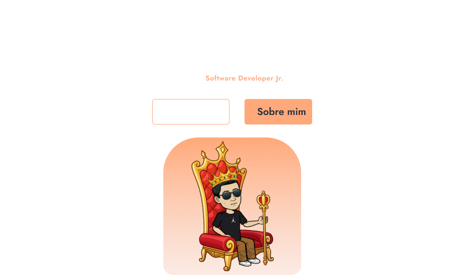
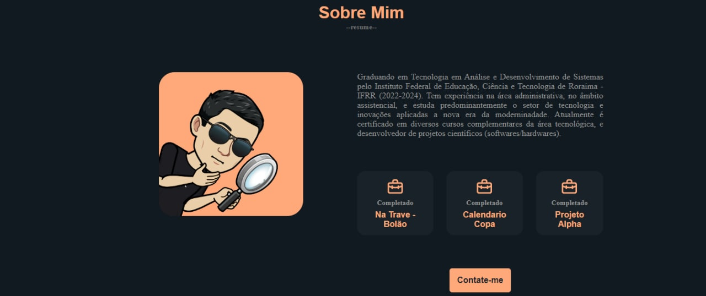

# 🚀💪🏻 PORTFOLIO - JHONSON MARLON

Bem-vindo(a). Este é o meu portfólio!

O objetivo deste projeto é demonstrar minhas habilidades de programação.

Caso tenha alguma dúvida, estou disponível no email *j.marlon.developer@gmail.com*

Boa vistoria de projeto!

> ⚠️ **É importante que entenda minha inicialidade em alguns pontos, pois estou aprendendo**

# 🧠 O PROJETO

O projeto foi implementar um portfolio para mostrar minhas hardskills e softskilss, como:

- [ ] Dinamização da apresentação
- [ ] Serviços exercidos
- [ ] Projetos já desenvolvidos

## ✔️ TECNOLOGIAS/MÉTODOS UTILIZADO(A)S:

Além dos requisitos levantados acima, foram utilizadas algumas tecnologias e métodos para construção do projeto:

- HTML
- CSS
- JAVASCRIPT
- Responsividade

## 😎 FOI UM PRAZER!

- Estamos finalizando mais um projeto, e com ele veio mais experiência, obrigado pela atenção e contribua com sugestôes do que melhorar, e outros projetos que queira ver aqui neste profile: https://github.com/Jhonsonmarlon

- link do disign: https://www.figma.com/file/2MLtwaAWArqlyOVqULOtuF/PortFolio-(Community)?node-id=1%3A3&t=AeTJgioIUIsqFTAC-0

---

_O desafio acima foi cuidadosamente construído para propósitos de aprendizado, e experiência._

Made with 🧑‍💻 at Jhonson_Marlon
